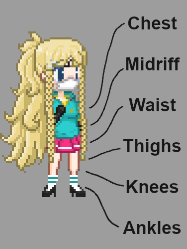

# Canvas model documentation

[[_TOC_]]

# Wiki

A reminder for the different states clothing can be in.

# Model options

## Clothes object

## Penetrator object

# To Do

## Clothes

### Structure

#### Lowerwear

Lowerwear generally remains along the player's positional states: waist, thighs, knees, and ankles.
Skirts are an exception to this rule. As they are tubular. And can be lifted up, beyond the head.

##### Short skirts

Mandatory states: waist, thighs, knees, and ankles.

Optional states: chest and midriff.

Missionary specifics:

-   Front and back: all?
-   Leg positioned: waist, thighs, knees, ankles.

Doggy specifics:

-   Front and back: all?

##### Long skirts

Mandatory states: waist, thighs, knees, and ankles.

Optional states: chest and midriff.

Missionary specifics:

-   Front and back: all?
-   Leg positioned: waist, thighs, knees, ankles.

##### Trousers

Mandatory states: waist, thighs, knees, and ankles.

Optional states: None.

Missionary specifics:

-   Front and back: all?
-   Leg positioned: waist, thighs, knees, ankles.

##### Shorts

Mandatory states: waist, thighs, knees, and ankles.

Optional states: None.

Missionary specifics:

-   Front and back: all?
-   Leg positioned: waist, thighs, knees, ankles.

### Issues

-   [ ] Shirt sprites have sleeves embedded into them, these should be moved to the sleeves of the sprites.

## Penetrators

Penetrator(s) need to be redesigned to rest upon the face of the PC:

-   img\sex\missionary\penetrators\human\mouth-entrance.png
-   img\sex\missionary\penetrators\human\mouth-imminent.png

Penetrator(s) need to be improved so the base of the penetrator does not seem too intrusive for when other NPC shadows are over it.

-   img\sex\missionary\penetrators\human\mouth-penetrated.png
